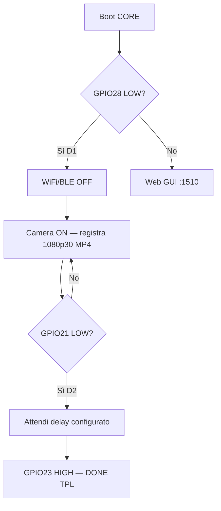

# Waveshare ESP32-P4-WIFI6-M — scheda CORE MrBin

| Campo | Valore |
|-------|--------|
| **Prodotto** | Waveshare ESP32-P4-WIFI6-M (SKU 31647) |
| **MCU principale** | ESP32-P4 (dual-core RISC-V 360 MHz, 32 MB PSRAM) |
| **Radio** | ESP32-C6-MINI-1 (Wi-Fi 6 / BLE 5 via SDIO) |
| **Camera** | MIPI-CSI 2-lane (es. OV5647 Raspberry Pi) |
| **Storage** | Slot TF SDIO 3.0 |
| **Framework** | **ESP-IDF ≥ 5.5** (consigliato da Waveshare) |

## GPIO MrBin (cablaggi PIR / TPL5111)

| Segnale | GPIO CORE | Livello | Descrizione |
|---------|-----------|---------|-------------|
| **D1** (wake movimento) | **28** | LOW attivo | PIR accende TPL → CORE capisce avvio per movimento |
| **D2** (fine movimento) | **21** | LOW attivo | Fine registrazione |
| **DONE** (TPL5111) | **23** | HIGH attivo | CORE chiede spegnimento al TPL5111 |

## Flusso operativo



## Sketch / firmware

Progetto ESP-IDF: `src/mrbin_core/`

```bash
cd src/mrbin_core
idf.py set-target esp32p4
idf.py build
idf.py -p COMx flash monitor
```

## Note hardware

- Alimentazione via TPL5111: mantenere **GPIO23 LOW** durante registrazione, **HIGH** solo per spegnimento.
- Durante registrazione PIR: radio spenta per risparmio energetico e stabilità encoder H.264.
- Web GUI disponibile su boot **senza D1** (manutenzione / configurazione con alimentazione continua o wake diverso).
